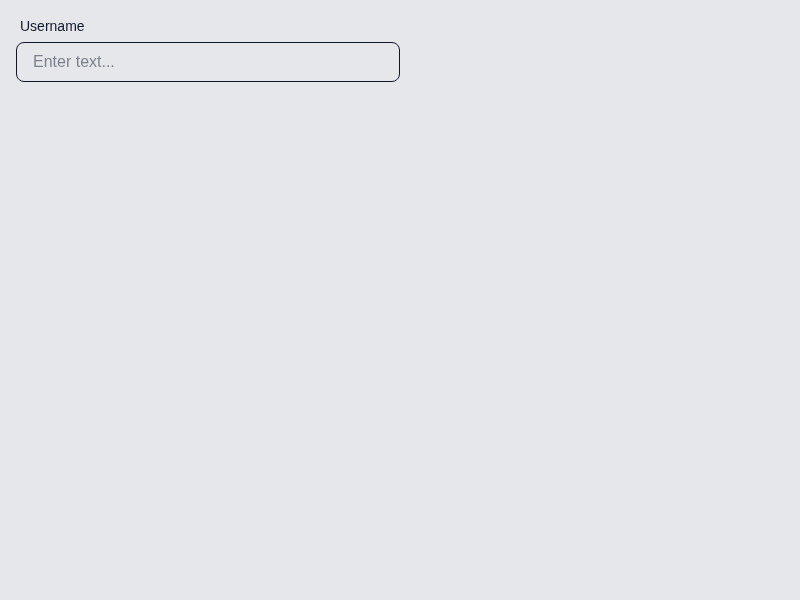
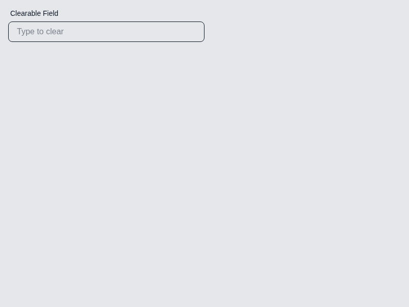
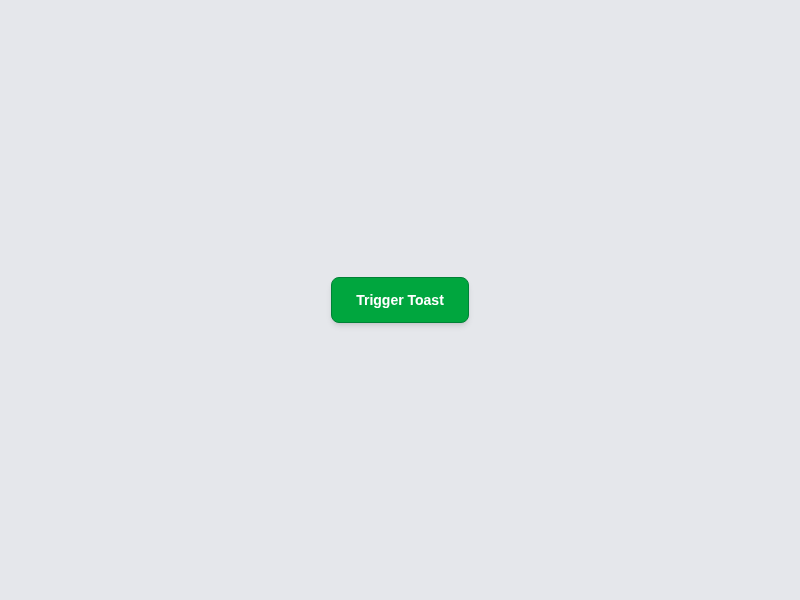
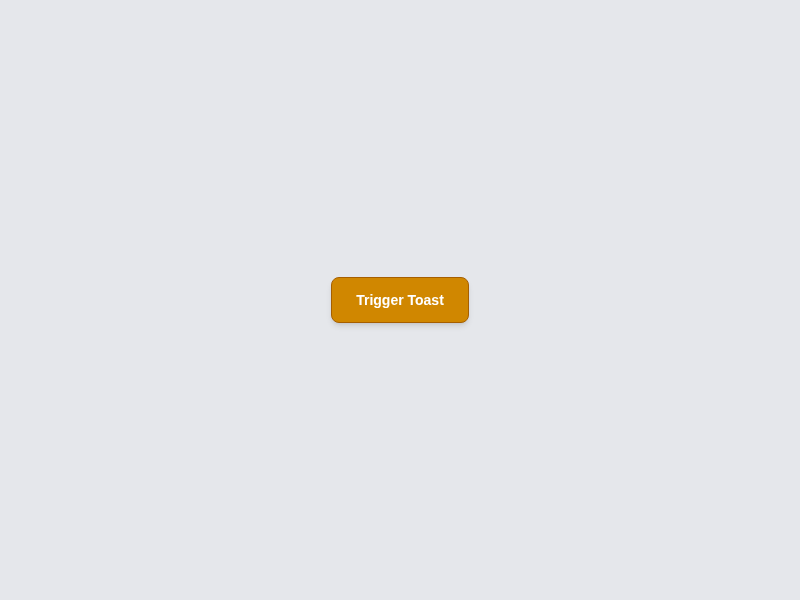
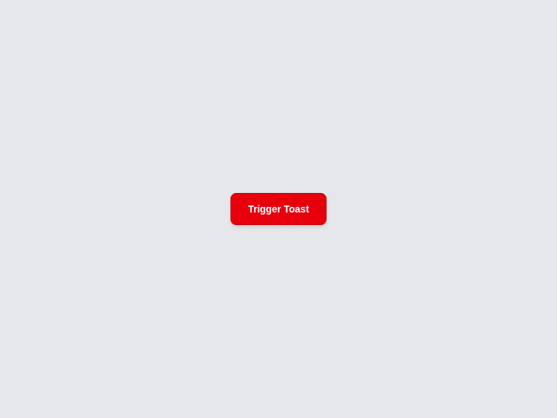

# Code Red Test Task

This project is a component library built with React, TypeScript, and Tailwind CSS. It uses Storybook for component development and testing.

## Setup Instructions

1.  **Install dependencies:**

    ```bash
    bun install
    ```

2.  **Run the development server:**

    ```bash
    npm run dev
    ```

3.  **Run Storybook:**

    ```bash
    npm run storybook
    ```

## Component Overview

This project contains the following components:

- **Input:** A customizable input component with support for labels, icons, and a clearable button.
- **Sidebar Menu:** A responsive sidebar menu that slides in from the right. It supports nested navigation items and can be closed by clicking on the background.
- **Toast:** A toast notification component with support for different variants (e.g., success, error, info, warning).

## Screenshots

### Input Component

**Default State:**



**With Icon:**


**Clearable:**



**With Error:**


### Sidebar Menu Component

**One Level:**


**One Level (Open State):**

.png>)

**Two Levels:**


**Two Level (Open State):**

.png>)

### Toast Component

**Info:**


**Info (Triggered):**

.png>)

**Success:**



**Success(Triggered):**

.png>)

**Warning:**



**Warning (Triggered):**

.png>)

**Error:**



**Error (Triggered):**

.png>)

**Non Closable (Manual Override):**

.png>)

**Non-closable (Triggered):**

.png>)
